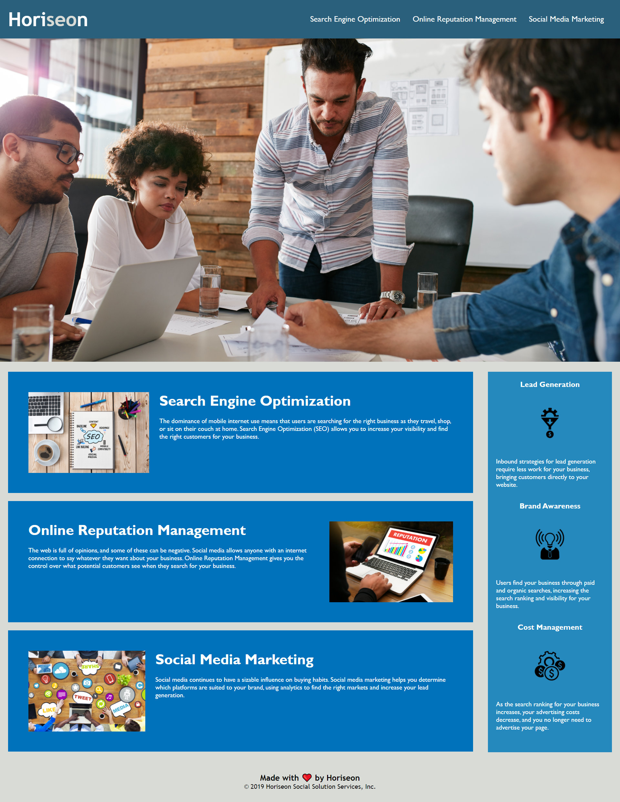

# Horiseon Project- Refactor

## Project Link

Click [here](https://kb3gum.github.io/homework-week-1/) to view project on GitHub pages.

## Description

To refactor Horiseon webpage for improved web accessibility and optimisation using semantic HTML elements

## What we did

- Rectified nav bar link to SEO section
- Changed HTML elements to semantic HTML elements along with improved structure,styling and positioning
- Used lint (prettier)to format code
- Added alt attributes to images and updated title for better accessibility

## Intial Steps

- Clone GitHub project to local machine
- Navigate into project
- Open project in VS Code
- Open file named index.html in default browser
- Git clone link: git@github.com:kb3gum/homework-week-1.git

## Screenshots

## Before we refactored webpage

## After we refactored webpage

